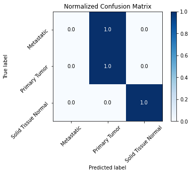
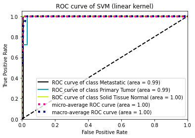
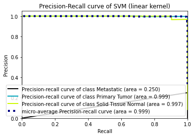
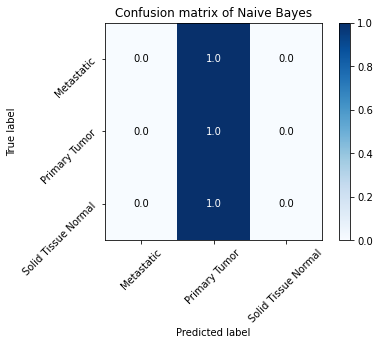
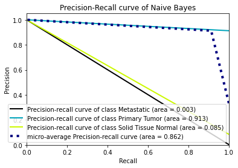
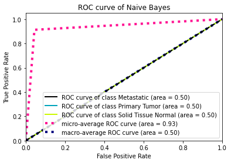
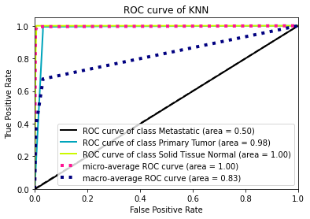
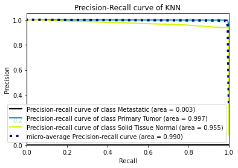

# BIM3008-Assignment 3 Report

### Introduction

Breast cancer is the most common cancer in women. To improve the survival rate of breast cancer patients, people try to identify the cancer stage and apply different treatments to patients. RNA-seq is a technology that reveals the transcription level of genes inside cells. Since cancers of different stages usually express different genes, we can use RNA-seq data to predict the cancer stages with machine learning algorithms. Data used in this project were retrieved from UCSC Xena ([RNA-seq data](https://xenabrowser.net/datapages/?dataset=TCGA-BRCA.htseq_fpkm.tsv&host=https%3A%2F%2Fgdc.xenahubs.net&removeHub=https%3A%2F%2Fxena.treehouse.gi.ucsc.edu%3A443), [phenotype label](https://xenabrowser.net/datapages/?dataset=TCGA-BRCA.GDC_phenotype.tsv&host=https%3A%2F%2Fgdc.xenahubs.net&removeHub=https%3A%2F%2Fxena.treehouse.gi.ucsc.edu%3A443)). 

### Methods

#### Support vector machine (SVM)

SVM

#### Gaussian Naive Bayes

#### K-nearest-neighbor (KNN)

#### Decision tree

#### Feature selection

#### Pipeline

### Results

#### 1. SVM

In this section, the performance of different algorithms will be shown.

| Classifier | Parameters               | Accuracy | Time (s) |
| ---------- | ------------------------ | -------- | -------- |
| SVM        | kernel='poly' (degree=3) | 0.987    | 2.81     |
| SVM        | kernel='sigmoid'         | 0.905    | 3.17     |
| SVM        | kernel='linear'          | 0.988    | 2.14     |
| SVM        | kernel:  'rbf'           | 0.985    | 3.28     |

Since the linear kernel has highest accuracy and shortest calculation time, linear kernel is used in downstream analysis. 

The confusion matrix, ROC curve, and recall-precision plot are drawn using the original data and the data predicted by linear kernel of SVM. 

Since there is only one metastatic sample in the testing set, the we can't just evaluate the performance using accuracy.

#### 2. Gaussian naive bayes classifier

We can see clearly from these graphs that naive bayes classifier did a very bad job in classifying different cancer of stages. 

#### 3. KNN

#### 4. Decision tree

We used 

### Conclusion

